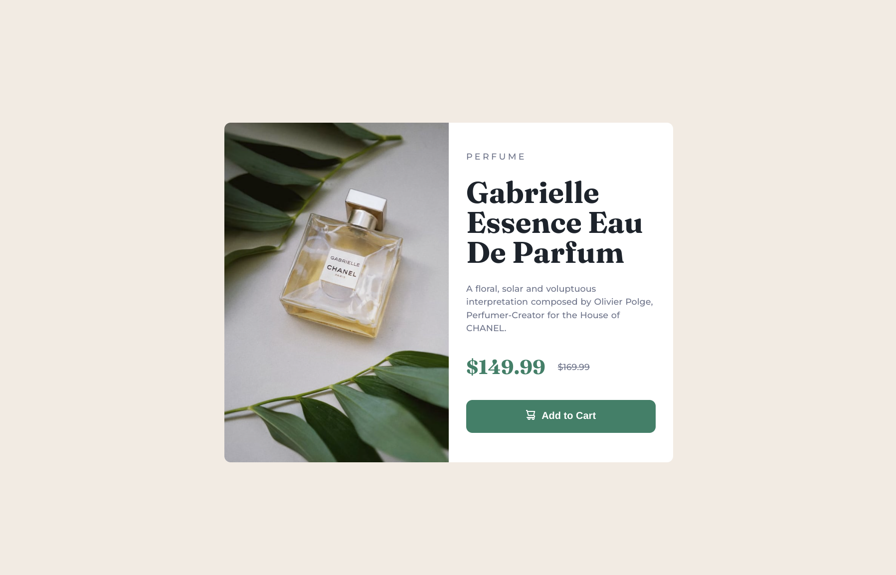
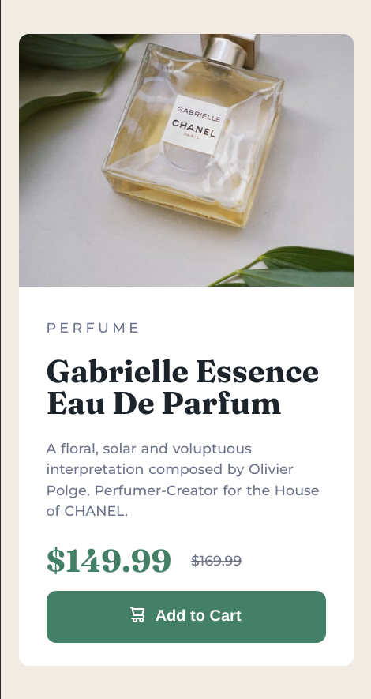

# Frontend Mentor - Product preview card component solution

This is a solution to the [Product preview card component challenge on Frontend Mentor](https://www.frontendmentor.io/challenges/product-preview-card-component-GO7UmttRfa). Frontend Mentor challenges help you improve your coding skills by building realistic projects. 

## Table of contents

- [Overview](#overview)
  - [The challenge](#the-challenge)
  - [Screenshots](#screenshots)
  - [Links](#links)
- [My process](#my-process)
  - [Built with](#built-with)
  - [What I learned](#what-i-learned)
  - [Continued development](#continued-development)
  - [Useful resources](#useful-resources)
- [Author](#author)
- [Acknowledgments](#acknowledgments)

## Overview

### The challenge

Users should be able to:

- View the optimal layout depending on their device's screen size
- See hover and focus states for interactive elements

### Screenshots

<ins> Frontend Mentor's Desktop Design: </ins>


<ins> My desktop solution: </ins>



<ins> Frontend Mentor's Mobile Design: </ins>


<ins> My mobile solution: </ins>



### Links

- Solution URL: [My solution deployed on Netlify](https://perfume-preview-card-moonji.com)

## My process

### Built with

- Semantic HTML5 markup
- CSS custom properties
- Flexbox
- CSS Grid

### What I learned

- It's better to use rem for font-size, percentage or not unit for line-height, and em for letter-spacing. (credit to FED MENTOR.DEV)
- <ins> max-inline-size</ins> defines the horizontal or vertical maximum size of an element's block, depending on its writing mode. (credit to web.dev and MDN Web Docs)
- <ins> block-size</ins> defines the horizontal or vertical size of an element's block, depending on its writing mode. And since we set it to "auto", it preserves the image's original aspect ratio as it's being resized. (credit to web.dev and MDN Web Docs)
- <ins> object-position</ins> allows you to adjust the focus of the cropped image (when using object-fit: cover, which naturally crops if needed).

```css
img {
    max-inline-size: 100%;
    block-size: auto;
    height: 100%;
    border-radius: 10px 0 0px 10px;
    object-fit: cover;
    object-position: center
}
```

### Continued development

I want to continue focusing on responsive design in future projects. I think most of what I learned worked out for this porject but I'm not sure I could do it again at this moment lol. I don't think I used the best method for creating this card so I would like to see other's solutions/strategies, but I think what I did works alright for now. 

### Useful resources

- [Web.dev: Responsive Design](https://web.dev/learn/design) - This helped me target which areas of responsive design I needed to implement.
- [Web.dev: Responsive Images](https://web.dev/learn/design/responsive-images?continue=https%3A%2F%2Fweb.dev%2Flearn%2Fdesign%23article-https%3A%2F%2Fweb.dev%2Flearn%2Fdesign%2Fresponsive-images) - This part in particular helped me make the Chanel image responsive.
- [FED MENTOR.DEV](https://fedmentor.dev/posts/font-size-px/) - This article is more subjective but offers great advice for when to use <ins>em</ins>s and <ins>rem</ins>s!

## Author

- Frontend Mentor - [@moonji-spoonji](https://www.frontendmentor.io/profile/moonji-spoonji)

## Acknowledgments

I'd like to thank Steven Stroud (@Stroudy) for the resources and suggestions he offered on my last challenge solution, the Recipe Page. I learned a lot about responsive design and tried to reinforce the key points in this project.
